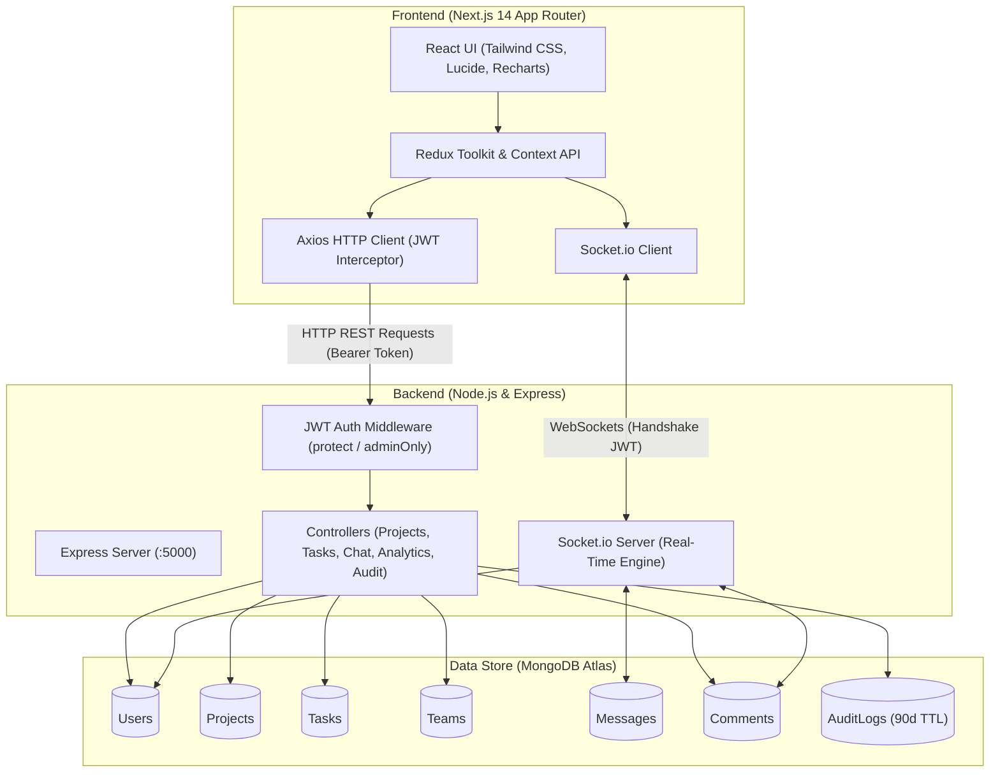

# 🚀 DevFlow — Developer Workflow & Collaboration Platform

[](https://nextjs.org/)
[](https://react.dev/)
[](https://www.typescriptlang.org/)
[](https://nodejs.org/)
[](https://www.mongodb.com/)
[](https://socket.io/)
[](https://tailwindcss.com/)

**DevFlow** is a modern, full-stack project management and collaboration platform built specifically for development teams. It brings together agile sprint planning, multiple task visualization views (Kanban, Table, and Gantt Timeline), real-time direct messaging, live task discussions, role-based access control (RBAC), team performance analytics, and system audit logging into a single cohesive workspace.

---

## 📑 Table of Contents

- [Key Features](#-key-features)
- [System Architecture](#-system-architecture)
- [Tech Stack](#-tech-stack)
- [Project Directory Structure](#-project-directory-structure)
- [Getting Started](#-getting-started)
  - [Prerequisites](#prerequisites)
  - [1. Clone Repository](#1-clone-repository)
  - [2. Server Setup](#2-server-setup)
  - [3. Client Setup](#3-client-setup)
  - [4. Seed Database](#4-seed-database)
- [Default Test Credentials](#-default-test-credentials)
- [Environment Variables](#-environment-variables)
- [REST API Reference](#-rest-api-reference)
- [Socket.io Real-Time Events](#-socketio-real-time-events)
- [Production Deployment](#-production-deployment)
- [License](#-license)

---

## ✨ Key Features

### 📋 Multi-View Task & Sprint Management
- **Kanban Board**: Drag-and-drop workflow tracking (`@dnd-kit`) across four status columns: `To Do`, `In Progress`, `In Review`, and `Completed`.
- **Data Table View**: High-density tabular view with sorting, status filtering, and priority indicators powered by `@tanstack/react-table`.
- **Gantt Timeline Chart**: Visual project roadmaps, schedule dependencies, and milestone tracking powered by `gantt-task-react`.
- **Task Creation & Assignment**: Set priorities (`Low`, `Medium`, `High`, `Urgent`), target due dates, tags, and assignees.

### 💬 Real-Time Collaboration
- **Live 1-on-1 Chat**: Direct real-time messaging powered by Socket.io, with conversation history persisted in MongoDB.
- **Presence & Status**: Real-time user online/offline status tracking with active user badges.
- **Typing Indicators**: Instant feedback when teammates are typing.
- **Task Comments Stream**: Live, broadcasted discussions on task cards with instant updates for all active viewers.

### 🛡️ Role-Based Access Control (RBAC) & Security
- **Admin & User Roles**: Distinct access levels and customized dashboard interfaces.
- **JWT Authentication**: Secure stateless token authentication with bcrypt password hashing.
- **Route Protection**: Server-side middleware (`protect` and `adminOnly`) and client-side route guards.

### 📊 Admin Command Center & Analytics
- **Executive KPI Dashboard**: Overview of total users, active projects, task throughput, and completion velocity.
- **Interactive Visualizations**: Status distribution and priority breakdown charts built with `Recharts`.
- **Comprehensive Audit Logs**: Automated tracking of administrative and user actions (`CREATE`, `UPDATE`, `DELETE`, `ASSIGN_TASK`, `CHANGE_ROLE`, etc.) with IP address, user agent, and automated 90-day retention index.
- **Team & User Management**: Manage organization members, reassign roles, configure team workspaces, and manage project assignments.

### 🎨 Modern Developer-Centric UI
- **Dark & Light Mode**: Seamless theme switching with persistent preferences.
- **Fluid Visuals**: WebGL Liquid Chrome dynamic shader background on landing pages.
- **Responsive Design**: Designed with Tailwind CSS for smooth usage on desktops, tablets, and mobile screens.

---

## 🏗️ System Architecture



---

## 🛠️ Tech Stack

### Frontend (`/client`)
- **Framework**: [Next.js 14](https://nextjs.org/) (App Router, React 18)
- **Language**: [TypeScript](https://www.typescriptlang.org/)
- **Styling**: [Tailwind CSS](https://tailwindcss.com/), `tailwindcss-animate`, `next-themes`
- **State Management**: [Redux Toolkit](https://redux-toolkit.js.org/), React Context API (`SocketContext`)
- **Drag & Drop**: `@dnd-kit/core`, `@dnd-kit/sortable`, `@dnd-kit/utilities`
- **Tables & Charts**: `@tanstack/react-table`, `recharts`, `gantt-task-react`, `@mui/x-data-grid`
- **HTTP & Sockets**: `axios`, `socket.io-client`
- **Visuals & Icons**: `lucide-react`, `ogl` (WebGL liquid shader)

### Backend (`/server`)
- **Runtime**: [Node.js](https://nodejs.org/) & [Express.js](https://expressjs.com/)
- **Language**: [TypeScript](https://www.typescriptlang.org/) (`ts-node`, `nodemon`)
- **Database ORM**: [Mongoose](https://mongoosejs.com/) (MongoDB)
- **WebSockets**: [Socket.io](https://socket.io/) (Real-time events, chat, presence)
- **Authentication**: `jsonwebtoken` (JWT), `bcryptjs`
- **Security & Logging**: `helmet`, `cors`, `morgan`, `dotenv`

---

## 📂 Project Directory Structure

```text
Dev_Workflow_and_collaboration_platform/
├── README.md
├── client/                               # Next.js Frontend Application
│   ├── public/                           # Static assets and icons
│   ├── src/
│   │   ├── app/                          # Next.js 14 App Router
│   │   │   ├── (auth)/                   # Authentication pages (login, register)
│   │   │   ├── (dashboard)/              # Protected application views
│   │   │   │   ├── admin/                # Admin portal (dashboard, analytics, audit-logs, teams, users)
│   │   │   │   ├── dashboard/            # Standard developer dashboard
│   │   │   │   ├── projects/             # Project details (Board, Table, Timeline, New, Edit)
│   │   │   │   └── settings/             # User settings
│   │   │   ├── layout.tsx                # Root layout & theme providers
│   │   │   └── page.tsx                  # Landing page
│   │   ├── components/                   # Reusable UI components
│   │   │   ├── Board/                    # Kanban board, columns, & task cards
│   │   │   ├── Table/                    # Data table view
│   │   │   ├── Timeline/                 # Gantt chart view
│   │   │   ├── chat/                     # 1-on-1 real-time chat panel
│   │   │   ├── comments/                 # Task comments component
│   │   │   ├── layout/                   # Sidebar, Navbar, AdminNav
│   │   │   └── Modal/                    # Task and project modals
│   │   ├── contexts/                     # SocketContext for real-time connection
│   │   ├── lib/                          # Axios instance, token helpers, navigation
│   │   ├── state/                        # Redux slices and store configuration
│   │   └── types/                        # TypeScript type definitions
│   ├── package.json
│   ├── tailwind.config.ts
│   └── tsconfig.json
│
└── server/                               # Express.js & MongoDB Backend
    ├── clean-and-seed.ts                 # Database reset and mock data seeding
    ├── create-users.ts                   # User initialization script
    ├── ecosystem.config.js               # PM2 production configuration
    ├── aws-ec2-instructions.md           # AWS EC2 deployment documentation
    ├── src/
    │   ├── config/                       # Database connection (Mongoose)
    │   ├── controllers/                  # Route logic (auth, projects, tasks, chat, etc.)
    │   ├── middleware/                   # Auth & role verification middleware
    │   ├── models/                       # Mongoose Schemas (User, Project, Task, Team, etc.)
    │   ├── routes/                       # Express route definitions
    │   ├── utils/                        # Logging & audit helper utilities
    │   └── index.ts                      # App entry point & Socket.io server
    ├── package.json
    └── tsconfig.json
```

---

## 🚀 Getting Started

### Prerequisites

Make sure you have the following installed on your machine:
- **Node.js**: `v18.x` or higher
- **npm** or **yarn**
- **MongoDB**: Local instance running on `mongodb://localhost:27017` or a [MongoDB Atlas](https://www.mongodb.com/atlas) connection string

---

### 1. Clone Repository

```bash
git clone https://github.com/wizif/the_project_.git
cd the_project_
```

---

### 2. Server Setup

1. Open a terminal and navigate to the `server` directory:
   ```bash
   cd server
   ```

2. Install dependencies:
   ```bash
   npm install
   ```

3. Configure environment variables by creating `.env`:
   ```env
   PORT=5000
   NODE_ENV=development
   MONGODB_URI=mongodb+srv://<username>:<password>@cluster0.example.mongodb.net/devflow?retryWrites=true&w=majority
   JWT_SECRET=your_super_secret_jwt_key_here
   JWT_EXPIRES_IN=7d
   ```

4. Start the development server:
   ```bash
   npm run dev
   ```
   *The server will run at `http://localhost:5000`.*

---

### 3. Client Setup

1. Open a new terminal and navigate to the `client` directory:
   ```bash
   cd client
   ```

2. Install dependencies:
   ```bash
   npm install
   ```

3. Configure environment variables in `client/.env`:
   ```env
   NEXT_PUBLIC_API_URL=http://localhost:5000/api
   ```

4. Start the Next.js development server:
   ```bash
   npm run dev
   ```
   *The client will run at `http://localhost:3000`.*

---

### 4. Seed Database

To populate your database with sample projects, tasks, and users, run the seed script from the `server` directory:

```bash
cd server
npx ts-node clean-and-seed.ts
```

---

## 🔑 Default Test Credentials

When running `clean-and-seed.ts` or `create-users.ts`, the following accounts are initialized:

| Role | Name | Email | Password | Access Level |
| :--- | :--- | :--- | :--- | :--- |
| **Admin** | Arnold | `arnold@gmail.com` | `arnold123` | Full Access (Dashboard, Analytics, Audit Logs, Team & User Management) |
| **User** | John Doe | `john@gmail.com` | `john123` | Developer Workspace (Projects, Tasks, Kanban, Chat) |
| **User** | Jane Smith | `jane@gmail.com` | `jane123` | Developer Workspace |
| **User** | Mike Johnson | `mike@gmail.com` | `mike123` | Developer Workspace |
| **User** | Sarah Williams | `sarah@gmail.com` | `sarah123` | Developer Workspace |

---

## 🔐 Environment Variables

### Backend (`server/.env`)

| Variable | Description | Example |
| :--- | :--- | :--- |
| `PORT` | Port for the Express and Socket.IO server | `5000` |
| `NODE_ENV` | Runtime environment (`development` / `production`) | `development` |
| `MONGODB_URI` | MongoDB connection URI (Atlas or local) | `mongodb://localhost:27017/devflow` |
| `JWT_SECRET` | Secret key used for signing JSON Web Tokens | `your_secret_hash_key` |
| `JWT_EXPIRES_IN` | Token expiration duration | `7d` |

### Frontend (`client/.env`)

| Variable | Description | Example |
| :--- | :--- | :--- |
| `NEXT_PUBLIC_API_URL` | Base endpoint for the backend API | `http://localhost:5000/api` |

---

## 📡 REST API Reference

All protected endpoints require the HTTP header:  
`Authorization: Bearer <JWT_TOKEN>`

### Authentication (`/api/auth`)
| Method | Endpoint | Access | Description |
| :--- | :--- | :--- | :--- |
| `POST` | `/api/auth/register` | Public | Register a new user account |
| `POST` | `/api/auth/login` | Public | Authenticate user & return JWT token |
| `GET` | `/api/auth/me` | Protected | Fetch current logged-in user profile |

### Projects (`/api/projects`)
| Method | Endpoint | Access | Description |
| :--- | :--- | :--- | :--- |
| `GET` | `/api/projects` | Protected | Get all projects associated with current user |
| `POST` | `/api/projects` | Admin Only | Create a new project |
| `GET` | `/api/projects/:id` | Protected | Retrieve specific project details |
| `PUT` | `/api/projects/:id` | Protected | Update project metadata or status |
| `DELETE` | `/api/projects/:id` | Admin Only | Delete project and associated records |

### Tasks (`/api/tasks`)
| Method | Endpoint | Access | Description |
| :--- | :--- | :--- | :--- |
| `GET` | `/api/tasks?projectId=:id` | Protected | List tasks (optionally filtered by project) |
| `GET` | `/api/tasks/:id` | Protected | Get details of a single task |
| `POST` | `/api/tasks` | Admin Only | Create a task under a project |
| `PUT` | `/api/tasks/:id` | Protected | Update task status, priority, or completion |
| `DELETE` | `/api/tasks/:id` | Admin Only | Delete task |

### Task Comments (`/api/comments`)
| Method | Endpoint | Access | Description |
| :--- | :--- | :--- | :--- |
| `GET` | `/api/comments/task/:taskId` | Protected | Fetch all comments for a task |
| `POST` | `/api/comments/task/:taskId` | Protected | Add a new comment to a task |
| `PUT` | `/api/comments/:commentId` | Protected | Edit comment content |
| `DELETE` | `/api/comments/:commentId` | Protected | Delete a comment |

### Direct Messages (`/api/chat`)
| Method | Endpoint | Access | Description |
| :--- | :--- | :--- | :--- |
| `GET` | `/api/chat/conversation/:userId` | Protected | Get conversation history with user |
| `GET` | `/api/chat/conversations` | Protected | List all active chats and last messages |
| `PUT` | `/api/chat/read/:userId` | Protected | Mark conversation as read |
| `GET` | `/api/chat/unread-count` | Protected | Get total count of unread messages |

### Teams (`/api/teams`)
| Method | Endpoint | Access | Description |
| :--- | :--- | :--- | :--- |
| `GET` | `/api/teams` | Protected | List all teams |
| `GET` | `/api/teams/:id` | Protected | Get team details and member list |
| `POST` | `/api/teams` | Admin Only | Create a new team |
| `PUT` | `/api/teams/:id` | Admin Only | Update team info or members |
| `DELETE` | `/api/teams/:id` | Admin Only | Delete a team |

### User Management (`/api/users`)
| Method | Endpoint | Access | Description |
| :--- | :--- | :--- | :--- |
| `GET` | `/api/users` | Protected | Get all users (used for chat & assignments) |
| `GET` | `/api/users/profile` | Protected | Get current user profile |
| `PUT` | `/api/users/profile` | Protected | Update current user profile |
| `GET` | `/api/users/:id` | Protected | Get specific user by ID |
| `PUT` | `/api/users/:id/role` | Admin Only | Update user role (`admin` or `user`) |
| `DELETE` | `/api/users/:id` | Admin Only | Remove user |

### Analytics (`/api/analytics`)
| Method | Endpoint | Access | Description |
| :--- | :--- | :--- | :--- |
| `GET` | `/api/analytics/dashboard-stats` | Protected | Overall user dashboard metrics |
| `GET` | `/api/analytics/project/:projectId` | Protected | Specific project velocity and metrics |
| `GET` | `/api/analytics/user-stats` | Protected | Personal task completion statistics |
| `GET` | `/api/analytics/admin` | Admin Only | Organization-wide platform analytics |

### Audit Logs (`/api/audit-logs`)
| Method | Endpoint | Access | Description |
| :--- | :--- | :--- | :--- |
| `GET` | `/api/audit-logs` | Admin Only | View system-wide audit activity logs |
| `GET` | `/api/audit-logs/user/:userId` | Admin Only | View audit events for a specific user |

---

## ⚡ Socket.io Real-Time Events

The server authenticates socket connections using JWT via the connection handshake (`auth: { token }`).

| Event (Client &rarr; Server) | Payload | Description |
| :--- | :--- | :--- |
| `sendMessage` | `{ receiverId, message }` | Sends direct message to recipient |
| `newComment` | `{ taskId, comment }` | Broadcasts task comment update |
| `typing` | `{ receiverId }` | Sends live typing indicator |
| `stopTyping` | `{ receiverId }` | Stops live typing indicator |

| Event (Server &rarr; Client) | Payload | Description |
| :--- | :--- | :--- |
| `onlineUsersList` | `{ userIds: string[] }` | List of currently online users upon connection |
| `userOnline` | `{ userId: string }` | Broadcast when a user connects |
| `userOffline` | `{ userId: string }` | Broadcast when a user disconnects |
| `newMessage` | `Message` | Received message payload |
| `messageSent` | `Message` | Confirmation back to message sender |
| `commentAdded` | `{ taskId, comment }` | Broadcast to update task comment feeds |
| `userTyping` | `{ userId, name }` | Notification that peer is typing |
| `userStopTyping` | `{ userId }` | Notification that peer stopped typing |

---

## 🌐 Production Deployment

### 1. Backend on AWS EC2 with PM2 & Nginx

1. **Provision EC2 Instance**: Use an Amazon Linux 2023 or Ubuntu instance.
2. **Install Node.js & PM2**:
   ```bash
   curl -o- https://raw.githubusercontent.com/nvm-sh/nvm/v0.39.7/install.sh | bash
   . ~/.nvm/nvm.sh
   nvm install 20
   npm install -g pm2
   ```
3. **Build and Run with PM2**:
   ```bash
   cd server
   npm install
   npm run build
   pm2 start ecosystem.config.js
   pm2 save
   pm2 startup
   ```
4. **Nginx Reverse Proxy**:
   Route incoming traffic from port 80/443 to `http://127.0.0.1:5000` with WebSocket upgrade headers:
   ```nginx
   location / {
       proxy_pass http://127.0.0.1:5000;
       proxy_http_version 1.1;
       proxy_set_header Upgrade $http_upgrade;
       proxy_set_header Connection "upgrade";
       proxy_set_header Host $host;
       proxy_cache_bypass $http_upgrade;
   }
   ```

### 2. Frontend on Vercel

1. Push your code to GitHub.
2. Import the repository into [Vercel](https://vercel.com).
3. Set the **Root Directory** to `client`.
4. Add the environment variable:
   - `NEXT_PUBLIC_API_URL`: Your production backend API URL (or use the built-in rewrite configuration in `vercel.json` / `next.config.mjs`).
5. Deploy!

---

## 📄 License

This project is licensed under the [ISC License](LICENSE).
