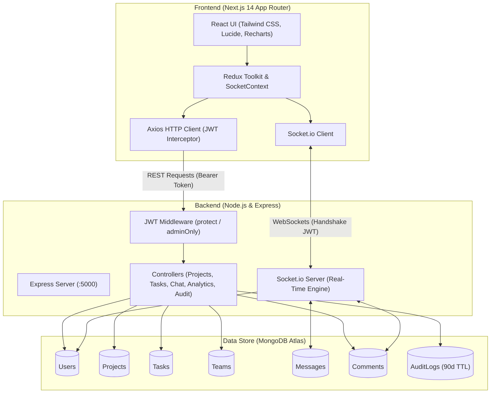

<div align="center">

# DevFlow

### Developer Workflow & Collaboration Platform

[](https://nextjs.org/)
[](https://react.dev/)
[](https://www.typescriptlang.org/)
[](https://nodejs.org/)
[](https://www.mongodb.com/)
[](https://socket.io/)
[](https://tailwindcss.com/)
[](https://devprojectflow-web-platform-devflow.vercel.app/)

<br />

<a href="https://git.io/typing-svg">
  
</a>

<p align="center">
  A full-stack project management and collaboration platform built for agile development teams, featuring multi-view task tracking, real-time messaging, role-based administration, and audit logging.
</p>

🌐 **Live Demo**: [https://devprojectflow-web-platform-devflow.vercel.app/](https://devprojectflow-web-platform-devflow.vercel.app/)

</div>

---

## Table of Contents

- [Overview](#overview)
- [Features](#features)
- [Architecture](#architecture)
- [Tech Stack](#tech-stack)
- [Project Structure](#project-structure)
- [Getting Started](#getting-started)
  - [Prerequisites](#prerequisites)
  - [1. Clone Repository](#1-clone-repository)
  - [2. Server Setup](#2-server-setup)
  - [3. Client Setup](#3-client-setup)
  - [4. Seed Database](#4-seed-database)
- [Seed Accounts](#seed-accounts)
- [Environment Variables](#environment-variables)
- [API Reference](#api-reference)
- [WebSocket Events](#websocket-events)
- [Deployment](#deployment)
- [License](#license)

---

## Overview

**DevFlow** provides engineering teams with an integrated environment to plan sprints, track tasks, and collaborate in real time. It combines project visualization tools (Kanban boards, structured tables, and Gantt charts) with live 1-on-1 team chat, task-level comment threads, activity audit logging, and team performance analytics.

---

## Features

### Multi-View Task Management
- **Kanban Board**: Drag-and-drop workflow progression powered by `@dnd-kit` across `To Do`, `In Progress`, `In Review`, and `Completed` columns.
- **Data Table View**: High-density table with column sorting, status filtering, and priority indicators built with `@tanstack/react-table`.
- **Gantt Timeline Chart**: Schedule visualization, dependency planning, and milestone tracking powered by `gantt-task-react` and `frappe-gantt`.
- **Task Attributes**: Priority tags (`Low`, `Medium`, `High`, `Urgent`), assignees, due dates, custom tags, and user completion tracking.

### Real-Time Collaboration
- **Direct Messaging**: 1-on-1 chat over WebSockets (Socket.io) with message persistence in MongoDB.
- **Presence Tracking**: Live online/offline status indicators for all team members.
- **Typing Indicators**: Real-time feedback when other participants are typing.
- **Live Comments**: Immediate broadcast of task comments to all active collaborators.

### Authentication & Access Control
- **Role-Based Access (RBAC)**: Distinct permissions and views for `admin` and `user` roles.
- **JWT Authentication**: Token-based authentication with bcrypt-hashed passwords.
- **Protected Endpoints**: Server-side route guards (`protect` and `adminOnly`) with automatic client token refresh/redirect handling.

### Admin Governance & Analytics
- **Dashboard Metrics**: High-level counters for total users, active projects, task distribution, and completion rates.
- **Visual Analytics**: Interactive status and priority distribution charts rendered with `Recharts`.
- **Audit Logging**: Comprehensive log of actions (`CREATE`, `UPDATE`, `DELETE`, `LOGIN`, `ASSIGN_TASK`, `CHANGE_ROLE`) with IP address, user agent, and automated 90-day TTL data expiration.
- **Team Management**: Team workspace creation, lead assignment, and project allocations.

### User Experience
- **Theme Modes**: Dark and light themes via `next-themes` and Tailwind CSS.
- **Landing Page Visuals**: Interactive WebGL Liquid Chrome shader background using `ogl`.
- **Responsive Layout**: Fully adaptive layouts across mobile, tablet, and desktop viewports.

---

## Architecture



---

## Tech Stack

### Frontend (`/client`)
- **Core**: Next.js 14 (App Router), React 18, TypeScript 5
- **Styling**: Tailwind CSS 3.4, Tailwind Animate, next-themes
- **State Management**: Redux Toolkit, `redux-persist`, React Context API (`SocketContext`)
- **Drag and Drop**: `@dnd-kit/core`, `@dnd-kit/sortable`, `@dnd-kit/utilities`, `react-dnd`
- **Data & Charts**: `@tanstack/react-table`, Recharts, `gantt-task-react`, `frappe-gantt`, `@mui/x-data-grid`
- **Networking**: Axios, Socket.io Client
- **Utilities**: `date-fns`, `lodash`, `numeral`, `uuid`
- **Icons & Graphics**: Lucide React, OGL (WebGL)

### Backend (`/server`)
- **Core**: Node.js, Express.js, TypeScript 5.9
- **Database**: MongoDB via Mongoose ODM
- **Real-Time**: Socket.io 4.8
- **Auth & Security**: JSON Web Tokens (`jsonwebtoken`), `bcryptjs`, Helmet, CORS
- **Process & Dev**: Nodemon, ts-node, Morgan, Dotenv

---

## Project Structure

```text
Dev_Workflow_and_collaboration_platform/
├── README.md
├── client/                               # Next.js Frontend Application
│   ├── public/                           # Static assets
│   ├── vercel.json                       # Vercel deployment configuration
│   ├── src/
│   │   ├── app/                          # Next.js 14 App Router
│   │   │   ├── (auth)/                   # Login & registration pages
│   │   │   ├── (dashboard)/              # Authenticated application views
│   │   │   │   ├── admin/                # Admin views (dashboard, analytics, audit-logs, teams, users)
│   │   │   │   ├── dashboard/            # Developer workspace
│   │   │   │   ├── projects/             # Project views (Kanban, Table, Timeline, New, Edit)
│   │   │   │   └── settings/             # User settings
│   │   │   ├── redux.tsx                 # Redux store provider wrapper
│   │   │   ├── layout.tsx                # App root layout
│   │   │   └── page.tsx                  # Landing page
│   │   ├── components/                   # UI components
│   │   │   ├── Board/                    # Kanban board, columns, task cards
│   │   │   ├── Table/                    # Task data table
│   │   │   ├── Timeline/                 # Gantt timeline chart
│   │   │   ├── chat/                     # 1-on-1 direct chat panel
│   │   │   ├── comments/                 # Task comment stream
│   │   │   ├── layout/                   # Sidebar, Navbar, AdminNav
│   │   │   └── Modal/                    # Creation and edit modals
│   │   ├── contexts/                     # SocketContext
│   │   ├── lib/                          # Axios client, navigation utilities
│   │   ├── state/                        # Redux slices and store setup
│   │   └── types/                        # TypeScript definitions
│   ├── package.json
│   ├── tailwind.config.ts
│   └── tsconfig.json
│
└── server/                               # Express.js Backend
    ├── clean-and-seed.ts                 # Database reset and full mock seed script
    ├── seed-data.ts                      # Lightweight data seeding script
    ├── seed-more-data.ts                 # Extended data seeding script
    ├── create-users.ts                   # User-only seeding script
    ├── ecosystem.config.js               # PM2 configuration
    ├── aws-ec2-instructions.md           # EC2 deployment instructions
    ├── src/
    │   ├── config/                       # Database connection setup
    │   ├── controllers/                  # Route handlers
    │   ├── middleware/                   # Authentication & role verification (auth, roleCheck, auditLogger)
    │   ├── models/                       # Mongoose schemas (User, Project, Task, Team, Message, Comment, AuditLog)
    │   ├── routes/                       # Express API routes
    │   ├── utils/                        # Logging & audit utilities
    │   └── index.ts                      # Server entry point & Socket.io handler
    ├── package.json
    └── tsconfig.json
```

---

## Getting Started

### Prerequisites
- **Node.js**: v18.x or higher
- **npm** or **yarn**
- **MongoDB**: Local MongoDB server or a [MongoDB Atlas](https://www.mongodb.com/atlas) cluster URI

---

### 1. Clone Repository

```bash
git clone https://github.com/wizif/the_project_.git
cd the_project_
```

---

### 2. Server Setup

```bash
cd server
npm install
```

Create a `.env` file in the `server` directory:

```env
PORT=5000
NODE_ENV=development
MONGODB_URI=mongodb://localhost:27017/devflow
JWT_SECRET=your_jwt_secret_key
JWT_EXPIRES_IN=7d
```

Start the backend server:

```bash
npm run dev
```

*Backend server starts at `http://localhost:5000`.*

---

### 3. Client Setup

In a separate terminal window:

```bash
cd client
npm install
```

Create a `.env` file in the `client` directory:

```env
NEXT_PUBLIC_API_URL=http://localhost:5000/api
```

Start the Next.js development server:

```bash
npm run dev
```

*Frontend application starts at `http://localhost:3000`.*

---

### 4. Seed Database

Several seeding scripts are available depending on how much data you need:

**Full reset + seed** (drops all existing data and inserts a complete mock dataset):
```bash
cd server
npx ts-node clean-and-seed.ts
```

**Lightweight seed** (adds base data without resetting):
```bash
npx ts-node seed-data.ts
```

**Extended seed** (adds additional sample data on top of existing):
```bash
npx ts-node seed-more-data.ts
```

**Users only** (creates test user accounts):
```bash
npx ts-node create-users.ts
```

---

## Seed Accounts

The seeding script generates the following test accounts:

| Role | Name | Email | Password | Scope |
| :--- | :--- | :--- | :--- | :--- |
| **Admin** | Arnold | `arnold@gmail.com` | `arnold123` | System-wide access, admin panel, analytics, audit logs |
| **User** | John Doe | `john@gmail.com` | `john123` | Project workspace, task updates, chat |
| **User** | Jane Smith | `jane@gmail.com` | `jane123` | Project workspace, task updates, chat |
| **User** | Mike Johnson | `mike@gmail.com` | `mike123` | Project workspace, task updates, chat |
| **User** | Sarah Williams | `sarah@gmail.com` | `sarah123` | Project workspace, task updates, chat |

---

## Environment Variables

### Backend (`server/.env`)

| Variable | Required | Description | Default |
| :--- | :---: | :--- | :--- |
| `PORT` | No | Express and Socket.io listening port | `5000` |
| `NODE_ENV` | No | Environment mode (`development` / `production`) | `development` |
| `MONGODB_URI` | Yes | MongoDB connection string | — |
| `JWT_SECRET` | Yes | Secret token for signing JWT credentials | — |
| `JWT_EXPIRES_IN` | No | Token lifetime string | `7d` |

### Frontend (`client/.env`)

| Variable | Required | Description | Default |
| :--- | :---: | :--- | :--- |
| `NEXT_PUBLIC_API_URL` | Yes | Base URL for REST API endpoints | `http://localhost:5000/api` |

---

## API Reference

Protected endpoints require the authorization header:  
`Authorization: Bearer <JWT_TOKEN>`

<details>
<summary><strong>Authentication (<code>/api/auth</code>)</strong></summary>

| Method | Endpoint | Access | Description |
| :--- | :--- | :--- | :--- |
| `POST` | `/api/auth/register` | Public | Register new user account |
| `POST` | `/api/auth/login` | Public | Authenticate user credentials & return JWT |
| `GET` | `/api/auth/me` | Protected | Return currently authenticated user profile |

</details>

<details>
<summary><strong>Projects (<code>/api/projects</code>)</strong></summary>

| Method | Endpoint | Access | Description |
| :--- | :--- | :--- | :--- |
| `GET` | `/api/projects` | Protected | List all projects belonging to the user |
| `POST` | `/api/projects` | Admin Only | Create a new project |
| `GET` | `/api/projects/:id` | Protected | Fetch specific project details |
| `PUT` | `/api/projects/:id` | Protected | Update project details or status |
| `DELETE` | `/api/projects/:id` | Admin Only | Delete a project |

</details>

<details>
<summary><strong>Tasks (<code>/api/tasks</code>)</strong></summary>

| Method | Endpoint | Access | Description |
| :--- | :--- | :--- | :--- |
| `GET` | `/api/tasks?projectId=:id` | Protected | List tasks (filtered by project ID) |
| `GET` | `/api/tasks/:id` | Protected | Retrieve specific task details |
| `POST` | `/api/tasks` | Admin Only | Create a task |
| `PUT` | `/api/tasks/:id` | Protected | Update task status, priority, or completion |
| `DELETE` | `/api/tasks/:id` | Admin Only | Delete a task |

</details>

<details>
<summary><strong>Task Comments (<code>/api/comments</code>)</strong></summary>

| Method | Endpoint | Access | Description |
| :--- | :--- | :--- | :--- |
| `GET` | `/api/comments/task/:taskId` | Protected | Retrieve comments on a task |
| `POST` | `/api/comments/task/:taskId` | Protected | Post a new comment |
| `PUT` | `/api/comments/:commentId` | Protected | Edit comment content |
| `DELETE` | `/api/comments/:commentId` | Protected | Delete comment |

</details>

<details>
<summary><strong>Direct Messaging (<code>/api/chat</code>)</strong></summary>

| Method | Endpoint | Access | Description |
| :--- | :--- | :--- | :--- |
| `GET` | `/api/chat/conversation/:userId` | Protected | Get conversation history with user |
| `GET` | `/api/chat/conversations` | Protected | List all active direct message threads |
| `PUT` | `/api/chat/read/:userId` | Protected | Mark conversation messages as read |
| `GET` | `/api/chat/unread-count` | Protected | Return total unread message count |

</details>

<details>
<summary><strong>Teams (<code>/api/teams</code>)</strong></summary>

| Method | Endpoint | Access | Description |
| :--- | :--- | :--- | :--- |
| `GET` | `/api/teams` | Protected | List all teams |
| `GET` | `/api/teams/:id` | Protected | Retrieve single team details |
| `POST` | `/api/teams` | Admin Only | Create a new team |
| `PUT` | `/api/teams/:id` | Admin Only | Update team info or members |
| `DELETE` | `/api/teams/:id` | Admin Only | Delete a team |

</details>

<details>
<summary><strong>Users (<code>/api/users</code>)</strong></summary>

| Method | Endpoint | Access | Description |
| :--- | :--- | :--- | :--- |
| `GET` | `/api/users` | Protected | List all registered users |
| `GET` | `/api/users/profile` | Protected | Get current user profile |
| `PUT` | `/api/users/profile` | Protected | Update current user profile |
| `GET` | `/api/users/:id` | Protected | Get single user by ID |
| `PUT` | `/api/users/:id/role` | Admin Only | Update user role (`admin` / `user`) |
| `DELETE` | `/api/users/:id` | Admin Only | Delete user |

</details>

<details>
<summary><strong>Analytics (<code>/api/analytics</code>)</strong></summary>

| Method | Endpoint | Access | Description |
| :--- | :--- | :--- | :--- |
| `GET` | `/api/analytics/dashboard-stats` | Protected | General dashboard statistics |
| `GET` | `/api/analytics/project/:projectId` | Protected | Project-specific performance data |
| `GET` | `/api/analytics/user-stats` | Protected | Personal task completion rates |
| `GET` | `/api/analytics/admin` | Admin Only | Platform-wide metrics and distribution |

</details>

<details>
<summary><strong>Audit Logs (<code>/api/audit-logs</code>)</strong></summary>

| Method | Endpoint | Access | Description |
| :--- | :--- | :--- | :--- |
| `GET` | `/api/audit-logs` | Admin Only | Fetch system audit event history |
| `GET` | `/api/audit-logs/user/:userId` | Admin Only | Fetch activity records for a specific user |

</details>

---

## WebSocket Events

Socket connections authenticate during the handshake via token payload:  
`io(url, { auth: { token: '<JWT>' } })`

### Client to Server

| Event | Payload | Purpose |
| :--- | :--- | :--- |
| `sendMessage` | `{ receiverId: string, message: string }` | Send a 1-on-1 direct message |
| `newComment` | `{ taskId: string, comment: object }` | Broadcast new task comment |
| `typing` | `{ receiverId: string }` | Emit typing status indicator |
| `stopTyping` | `{ receiverId: string }` | Emit typing stopped status |

### Server to Client

| Event | Payload | Purpose |
| :--- | :--- | :--- |
| `onlineUsersList` | `{ userIds: string[] }` | Sent on connection with active user IDs |
| `userOnline` | `{ userId: string }` | Broadcast when a user connects |
| `userOffline` | `{ userId: string }` | Broadcast when a user disconnects |
| `newMessage` | `Message` | Incoming direct message object |
| `messageSent` | `Message` | Confirmation response to sender |
| `commentAdded` | `{ taskId: string, comment: object }` | Broadcasted comment to update UI |
| `userTyping` | `{ userId: string, name: string }` | Peer started typing notification |
| `userStopTyping` | `{ userId: string }` | Peer stopped typing notification |

---

## Deployment

### Backend (AWS EC2 + PM2 + Nginx)

1. Provision an Ubuntu / Amazon Linux instance.
2. Install Node.js 20 and PM2:
   ```bash
   curl -o- https://raw.githubusercontent.com/nvm-sh/nvm/v0.39.7/install.sh | bash
   . ~/.nvm/nvm.sh
   nvm install 20
   npm install -g pm2
   ```
3. Clone repository and build:
   ```bash
   cd server
   npm install
   npm run build
   pm2 start ecosystem.config.js
   pm2 save
   pm2 startup
   ```
4. Configure Nginx reverse proxy with WebSocket upgrade support:
   ```nginx
   location / {
       proxy_pass http://127.0.0.1:5000;
       proxy_http_version 1.1;
       proxy_set_header Upgrade $http_upgrade;
       proxy_set_header Connection "upgrade";
       proxy_set_header Host $host;
       proxy_cache_bypass $http_upgrade;
   }
   ```

> Refer to [`aws-ec2-instructions.md`](server/aws-ec2-instructions.md) for the full step-by-step EC2 setup guide.

### Frontend (Vercel)

1. Import the repository into [Vercel](https://vercel.com).
2. Set the root directory to `client`.
3. Set `NEXT_PUBLIC_API_URL` to your production backend endpoint.
4. Deploy the application.

The `client/vercel.json` file is pre-configured for clean Next.js routing on Vercel.

🌐 **Deployed at**: [https://devprojectflow-web-platform-devflow.vercel.app/](https://devprojectflow-web-platform-devflow.vercel.app/)

---
